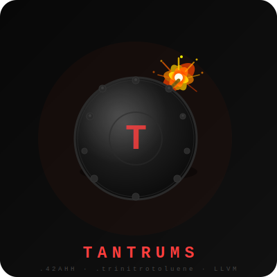

<div align="center">

<br>

<div align="center">
  
</div>

<br>

```
████████╗ █████╗ ███╗   ██╗████████╗██████╗ ██╗   ██╗███╗   ███╗███████╗
╚══██╔══╝██╔══██╗████╗  ██║╚══██╔══╝██╔══██╗██║   ██║████╗ ████║██╔════╝
   ██║   ███████║██╔██╗ ██║   ██║   ██████╔╝██║   ██║██╔████╔██║███████╗
   ██║   ██╔══██║██║╚██╗██║   ██║   ██╔══██╗██║   ██║██║╚██╔╝██║╚════██║
   ██║   ██║  ██║██║ ╚████║   ██║   ██║  ██║╚██████╔╝██║ ╚═╝ ██║███████║
   ╚═╝   ╚═╝  ╚═╝╚═╝  ╚═══╝   ╚═╝   ╚═╝  ╚═╝ ╚═════╝ ╚═╝     ╚═╝╚══════╝
```

<br>

**A vibe-coded, natively compiled, aggressively fast programming language.**  
*Built from scratch. Powered by LLVM. Held together by raw ambition and questionable life choices.*

<br>

[](https://en.cppreference.com/w/cpp/23)
[](https://llvm.org/)
[](https://www.gnu.org/licenses/gpl-3.0)
[](#)
[](#)

<br>

[Philosophy](#-philosophy) · [Architecture](#%EF%B8%8F-architecture) · [Type System](#-type-system) · [Memory Model](#-memory-model) · [Language Design](#-language-design) · [Tooling](#-vs-code-tooling) · [Roadmap](#%EF%B8%8F-roadmap)

<br>
<br>

</div>

---

## ⚠️ Brutally Honest Disclosure

This entire language — the lexer, the recursive-descent parser, the Abstract Syntax Tree, the embedded LLVM code generator, the C-level runtime, and the VS Code extension — was **entirely vibe-coded with heavy AI assistance.** 

No Dragon Books were consulted. No formal language theory was harmed. No Computer Science PhD was involved. What *was* involved: relentless iteration, raw curiosity, zero respect for "the right way to do things," and an unreasonable amount of late-night determination from a 10th grader who just wanted to see if it was possible.

It is possible. It compiles. It's fast. And it will absolutely bite you if you don't read this document.

---

<br>

## 💡 Philosophy

Most programming languages are designed by committees, shaped by years of academic consensus, and sanded down into something palatable for the widest possible audience. Tantrums is none of those things.

Tantrums exists because the question *"what if I just... built one?"* demanded an answer. It is a language designed around **execution speed**, **developer flexibility**, and the deeply personal satisfaction of watching a program you wrote from absolute zero emit real, native machine code that runs directly on hardware.

There are no garbage collectors silently taxing your game loops. No borrow checkers arguing with you about lifetime annotations. No hidden virtual machines interpreting byte streams at runtime. When Tantrums runs your program, it runs. Directly. On the CPU. Exactly as fast as the machine allows.

The name? Because sitting at midnight writing a bespoke recursive-descent parser, an AST code generator, and an LLVM IR emitter simultaneously — from scratch — will make you want to throw one.

<br>

---

## ⚙️ Architecture

### The Compilation Pipeline

Tantrums transforms your source file through a multi-stage pipeline, each stage purpose-built and tightly integrated:

```
  ┌─────────────────┐
  │  Source (.42AHH) │
  └────────┬────────┘
           │
           ▼
  ┌─────────────────┐
  │     Lexer        │  Raw source text → token stream
  │  (lexer.cpp)     │  Handles: keywords, operators, string literals,
  └────────┬────────┘  escape sequences, file-level directives
           │
           ▼
  ┌─────────────────┐
  │     Parser       │  Token stream → Abstract Syntax Tree
  │  (parser.cpp)    │  Recursive descent. Full forward-reference pre-scan.
  └────────┬────────┘  Syntactic validation + structure resolution.
           │
           ▼
  ┌─────────────────┐
  │    Compiler      │  AST → Validated, scope-annotated IR
  │ (compiler.cpp)   │  Type inference, escape analysis, semantic checks,
  └────────┬────────┘  arity validation, memory safety enforcement.
           │
           ▼
  ┌─────────────────┐
  │  LLVM Codegen    │  Validated AST → LLVM IR → Native binary
  │(LLVMCodegen.cpp) │  Math intrinsics fused directly. NaN-boxed 64-bit
  └────────┬────────┘  value format. No ABI sret overhead.
           │
           ▼
  ┌─────────────────┐
  │ Native Executable│  Standard platform binary (ELF / PE)
  │  (.exe / ELF)    │  Runs standalone. No runtime dependency. No VM.
  └─────────────────┘
```

### Value Representation

Every value in Tantrums — integers, floats, booleans, strings, pointers, lists — is represented internally as a single **64-bit NaN-boxed `uint64_t`**. This means:

- Function arguments pass in registers, not on the heap
- No `sret` (struct return) ABI overhead
- Type tags are encoded within the NaN payload, checked with bitmasking
- The value size is constant and predictable at every layer of the pipeline

This is the same fundamental technique used by high-performance JavaScript engines (V8, SpiderMonkey) and is one of the primary reasons Tantrums punches far above its weight in raw throughput benchmarks.

### The Runtime Layer

The runtime (`runtime.cpp`) handles everything that happens *after* LLVM emits the binary: exception dispatch via `setjmp`/`longjmp`, scope tracking for the auto-free system, pointer lifecycle validation (null checks, double-free detection, use-after-free guards), and the memory profiling API. It is a lean C-level foundation — no overhead for things you didn't ask for.

<br>

---

## 🎛️ Type System

Tantrums makes a choice most languages refuse to: it lets you pick your own philosophy, per file, with a single directive.

### `#mode static;` — Full Enforcement

Every variable has a type. Every function declares a return type. Every code path must provably return a value or throw. Type mismatches are hard compile errors. This is the mode you use when you're building something real and you want the compiler to catch your mistakes before they become runtime disasters.

The compiler performs full type inference at compile time — it knows that `a + b` where both sides are `int` produces an `int`, that comparisons always produce `bool`, that dereferencing an `int*` yields an `int`. When it can infer the type, it enforces it. When it can't, it passes through dynamically.

### `#mode dynamic;` — Zero Restrictions

Type annotations are accepted but ignored. Any variable can hold any value. An `int x` can have a string assigned to it on the next line without complaint. This mode is for rapid prototyping, quick scripts, and the moments when you just need the logic to *run* and you'll clean it up later.

### `#mode both;` — The Harmonized Default

When no directive is specified, `#mode both` is assumed. Typed variables are type-checked. Untyped bare assignments are fully dynamic. You get the safety where you explicitly asked for it, and the flexibility everywhere else. This is Tantrums at its most characteristic — structured where structure was declared, free where freedom was implied.

### Type Coercion

When a typed variable is initialized with a value of a compatible but distinct type, Tantrums coerces automatically and predictably:

| Source | Target | Result |
|--------|--------|--------|
| `3.9` | `int` | `3` (truncation, not rounding) |
| `5` | `float` | `5.0` |
| `42` | `string` | `"42"` |
| `0` | `bool` | `false` |
| `"hello"` | `bool` | `true` (non-empty string) |

Coercion is always explicit in the AST — the compiler emits a cast node (`OP_CAST`). It is never silent or surprising.

### Primitive Types

| Type | Description | Default |
|------|-------------|---------|
| `int` | 64-bit signed integer | `0` |
| `float` | 64-bit IEEE 754 double | `0.0` |
| `bool` | `true` or `false` | `false` |
| `string` | UTF-8 immutable string | `""` |
| `list` | Dynamic array, mixed types | `[]` |
| `map` | Hash map, any key/value types | `{}` |
| `null` | Absence of value | — |
| `int*`, `float*`, ... | Heap-allocated pointer | `null` |

<br>

---

## 🧠 Memory Model

Memory in Tantrums is an explicit choice you make, not something that happens to you. The system is built in two philosophies that you select at the top of your file:

### `#autoFree true;` (Default)

The compiler and runtime collaborate to automatically manage memory for you — specifically for pointers, lists, and maps that are **provably local** to their declaring scope.

**Layer 1 — Compile-Time Escape Analysis:** After each `alloc` declaration, the compiler walks the remaining statements in the block. If a pointer provably does not escape — never returned, never passed to a function, never aliased, never stored in a map — the compiler emits an automatic `OP_FREE` instruction before scope exit and notes it:

```
[Tantrums] note: auto-freed 'p' at line 12 (provably local)
```

A pointer is considered escaped (and therefore NOT auto-freed at compile time) if it appears in a return statement, is passed as a function argument, is aliased via assignment, is stored in a map, or appears inside a conditional branch. The compiler is conservative — when in doubt, it defers to runtime.

**Layer 2 — Runtime Scope Tracking:** `OP_ENTER_SCOPE` and `OP_EXIT_SCOPE` instructions bookend every block. On scope exit, the runtime walks all objects allocated since the scope marker and frees any pointer or collection that wasn't flagged as escaped. This catches everything the compile-time analysis couldn't prove statically.

On exit, a full auto-free report is generated. Up to 20 entries are printed directly to stdout; larger reports are written to `autoFree.txt` alongside the executable.

### `#autoFree false;` — Full Manual Control

You own every allocation. The compiler and runtime step back from lifecycle management entirely. `alloc` and `free` are entirely your responsibility. Leak detection still runs at exit — you'll know exactly what you forgot.

### `#allowMemoryLeaks true;`

Requires `#autoFree false` declared first. Designed for **arena and region allocation patterns** — the legitimate pattern of allocating a large pool of objects and letting the OS reclaim everything at process exit rather than individually freeing each one. Compile-time detected leaks become warnings instead of hard errors. The exit leak report still fires.

Combining `#allowMemoryLeaks true` with `#autoFree true` is a **compile error** — those two philosophies are logically incompatible and Tantrums will tell you so.

### Runtime Safety — Always Active

Regardless of which memory mode you choose, these checks are always running and cannot be disabled:

- **Null pointer dereference** → caught, throws a descriptive runtime error with a full stack trace
- **Double-free** → caught, throws before corruption occurs  
- **Use-after-free** → caught, throws with the originating allocation info
- All of these are **catchable** inside `try` blocks — a runtime memory error is just another exception

### Leak Reporting

At program exit, any allocation that was never freed is reported:

- Up to 5 leaks: printed directly to stderr
- More than 5 leaks: written to `memleaklog.txt` with full grouping, byte counts, and source location info (file, function, line number)

Identical leaks from the same source location are grouped with a `[xN]` multiplier. The summary shows total leaked bytes, KB, MB, and GB as appropriate.

<br>

---

## 🏗️ Language Design

### Functions

Functions are declared with the `tantrum` keyword — the only one that matters. All functions are defined at global scope; no nested function declarations, no closures, no anonymous lambdas. Every program requires a `main()` function which is called automatically.

```
tantrum <return_type> <name>(<params>) { ... }
```

The compiler performs a **full pre-scan of all function signatures** before compiling a single line. This means you can call a function defined later in the same file — or in an imported file — without any forward declaration syntax. Everything is available everywhere, always.

Return values must be wrapped in parentheses — `return (value);`. This is enforced by the parser. It is intentional, it is consistent, and after five minutes it will feel completely natural.

### Control Flow

**`if` / `else if` / `else`** — Standard conditional branching. Conditions must evaluate to `bool` at runtime. A non-boolean in a condition is a runtime error, not a silent cast.

**`while`** — Standard conditional loop with `break` and `continue` support. Both correctly unwind nested scopes before jumping.

**`for i in`** — Range-based iteration over `range()` objects, strings, lists, and maps. The `range()` built-in is lazy — no intermediate list is allocated. Iterating a string yields individual characters. Iterating a map yields keys in hash-table order. The loop variable is strictly local to the loop body.

**`switch`** — Tantrums switches default to **auto-break mode** (`#switchBreakMode false`): each matched case runs its body and exits automatically, like Python's `match` or Rust's `match`. If you want traditional C-style fallthrough, `#switchBreakMode true` re-enables it. The `default` case always executes last regardless of where it's written in the source.

### Error Handling

Tantrums uses `try` / `catch` / `throw` with exception semantics that compile down to `setjmp`/`longjmp` at the C runtime level. Any value can be thrown — strings, integers, anything. Any runtime error (null dereference, division by zero, double-free) becomes a catchable exception when it occurs inside a `try` block.

Nested `try` blocks work correctly. Rethrowing from inside a `catch` works correctly. The caught exception value is bound as a local variable in the `catch` scope.

### The Math Library

Math functions are not looked up in a dictionary at runtime. The compiler identifies `math.*` calls during AST traversal and fuses them directly into native LLVM math intrinsics — `sin`, `cos`, `tan`, `sec`, `cosec`, `cot`, `floor`, `ceil`, `random_int`, `random_float`. There is no map lookup, no function dispatch overhead, no hash collision to resolve. It's a direct instruction.

### The Filesystem Library

File I/O is available via `use filesystem;`. All 17 functions (`read`, `write`, `append`, `exists`, `delete`, `mkdir`, `mkfile`, `listdir`, `isfile`, `isdir`, `copy`, `move`, `size`, `readlines`, `writelines`, `cwd`, `abspath`) compile directly to native LLVM calls — same zero-dispatch pattern as the math library.

All path arguments support the `${USERHOME}` prefix, resolved at runtime to `USERPROFILE` on Windows and `HOME` on macOS/Linux. All I/O errors throw catchable Tantrums runtime errors, so any filesystem call can be wrapped in `try`/`catch`. This is the first stdlib module that performs I/O, establishing the error-throwing pattern for all future I/O modules.

### Imports

Tantrums uses a source-injection import model. When you `use "file.42AHH"`, the imported file is lexed, parsed, and its top-level declarations are injected inline into the current compilation. The imported file's own `#mode`, `#autoFree`, and `#allowMemoryLeaks` directives apply independently to its declarations — mixed-mode imports work correctly. Circular imports are detected and prevented. Duplicate imports of the same file are silently deduplicated.

### Operators

All the standard arithmetic, comparison, and logical operators are present. A few worth noting:

- **String concatenation via `+`**: The `+` operator auto-converts the non-string side to a string. `"score: " + 42` produces `"score: 42"`. No explicit casting required.
- **List concatenation via `+`**: `[1, 2] + [3, 4]` produces `[1, 2, 3, 4]`. Either or both sides can be a `range`.
- **Pointer dereference via `*`**: `*p` reads or writes through a heap pointer. Prefix unary `*` only — no pointer arithmetic, no casting between pointer types.
- **Compound assignment**: `+=`, `-=`, `*=`, `/=`, `%=` are all desugared by the parser to their binary equivalents.
- **Prefix and postfix `++`/`--`**: Both forms work. Prefix returns the new value; postfix returns the old value before incrementing.

<br>

---

## 📊 Profiling & Memory APIs

Tantrums ships with a first-class profiling API baked directly into the language. No external libraries. No `#include` chains. No installation.

### Timing

| Function | Returns | Description |
|----------|---------|-------------|
| `getCurrentTime()` | `int` | Unix epoch time in milliseconds |
| `toSeconds(ms)` | `float` | Convert ms → seconds |
| `toMilliseconds(ms)` | `float` | Normalize ms as float |
| `toMinutes(ms)` | `float` | Convert ms → minutes |
| `toHours(ms)` | `float` | Convert ms → hours |

### Memory

| Function | Returns | Description |
|----------|---------|-------------|
| `getProcessMemory()` | `int` | Process RSS in bytes (OS-level) |
| `getHeapMemory()` | `int` | Current Tantrums-managed heap in bytes |
| `getHeapPeakMemory()` | `int` | Peak heap usage since program start |
| `bytesToKB(n)` | `float` | Bytes → kilobytes |
| `bytesToMB(n)` | `float` | Bytes → megabytes |
| `bytesToGB(n)` | `float` | Bytes → gigabytes |

`getProcessMemory()` is platform-aware — it calls `GetProcessMemoryInfo` on Windows, `mach_task_basic_info` on macOS, and reads `/proc/self/statm` on Linux.

<br>

---

## 🛠️ Building from Source

Tantrums requires **CMake 3.15+**, a **C++23-capable compiler** (GCC 13+ or Clang 16+ strongly recommended — do not use MSVC), and LLVM developer libraries in your PATH.

```bash
# Clone
git clone https://github.com/Plexescor/tantrums.git
cd tantrums

# Configure (Release recommended — Debug can be ~2x slower)
cmake -B build -S . -DCMAKE_BUILD_TYPE=Release

# Build
cmake --build build --config Release
```

Output binary locations:

| Platform | Path |
|----------|------|
| Windows | `.\build\Release\tantrums.exe` |
| Linux / macOS | `./build/tantrums` |

### CLI Usage

```bash
tantrums build main.42AHH          # Compile to native executable
tantrums run main.42AHH            # Compile and run immediately
tantrums run --no-autofree-notes main.42AHH  # Suppress auto-free notes
```

The `--no-autofree-notes` flag suppresses inline `[Tantrums] note: auto-freed 'x'` messages during execution. The `autoFree.txt` report written on exit is unaffected.

On startup, the runtime prints:
```
[Tantrums] Mode: both (typed + dynamic)
[Tantrums] Built: main.exe
```

Source files must use the `.42AHH` or `.trinitrotoluene` extension. Any other extension is rejected at the CLI level before compilation begins.

<br>

---

## 🎨 VS Code Tooling

Tantrums ships an officially bundled VS Code extension in the `tantrums-vscode/` directory. Copy it into `%USERPROFILE%\.vscode\extensions\` (Windows) or `~/.vscode/extensions/` (Linux/macOS), restart VS Code, and open any `.42AHH` file.

**What you get:**

- **Syntax highlighting** — Full coverage of keywords, directives, type annotations, control flow, math library calls, filesystem library calls, built-ins, string escapes, and comments. Distinct colors for every semantic layer.
- **IntelliSense & snippets** — 30+ snippet definitions for loop structures, mode directives, pointer patterns, switch blocks, try/catch, and file-level directive combinations. Tab-completeable, parameter-aware.
- **Hover documentation** — Hover any keyword, built-in function, or memory command to see its return type signature and usage documentation inline.
- **Live diagnostics** — On-save parsing that surfaces memory leak patterns, type checking violations, unresolved identifiers, and dead-branch logic directly in the editor gutter.

<br>

---

## 🗺️ Roadmap

Tantrums just completed the most significant architectural shift in its history: ripping out the stack-based bytecode VM entirely and replacing it with a full LLVM native compilation pipeline. That transition is complete. Here's where it goes from here:

### v1.0 — Current
Full LLVM native codegen. try/catch exception handling via C setjmp/longjmp. Math library AST intrinsic fusion. Filesystem stdlib with full cross-platform file and directory I/O, `${USERHOME}` path resolution, and catchable runtime errors for all I/O failures. File-level mode enforcement. VS Code extension. Comprehensive leak and auto-free reporting.

### v2.0 — The Standard Integration
Full restoration of the 7-layer escape analysis system, rewritten in pure LLVM IR (not bytecode-layer as before). Slab allocation optimizations to outperform standard `malloc` on repeated alloc/free cycles. IO module abstractions. String module (split, trim, replace, indexOf, substring, toLower, toUpper).

### v3.0 — The Graphical Standard
Win32 windowing module wrappers accessible from within typed Tantrums code. Native OpenGL pipeline bindings. This is the version that makes Tantrums viable as a game scripting layer.

### v4.0 — Deep Optimization
Link-Time Optimization (LTO). Aggressive static branch elimination. Automatic SIMD vectorization injection by the compiler for recognized loop patterns. The version where Tantrums stops being fast and starts being unreasonable.

**Not yet implemented (as of current snapshot):**
C/C++ FFI · Networking · Audio · Package manager · Address-of operator (`&`) · String module · IO module

<br>

---

## 📐 Hard Limits Reference

For those who need to know exactly where the walls are:

| Limit | Value | Location |
|-------|-------|----------|
| Max imports per file | 64 | `compile_source` |
| Max tracked globals | 512 | `MAX_GLOBALS` |
| Max function signatures | 256 | `MAX_FUNC_SIGS` |
| Max typed params checked per function | 16 | Compiler |
| Max break/continue jumps per loop | 64 | Compiler |
| Max constants per function | 65535 | `uint16_t` index |
| Max unique leak groups in report | 100 | `memleaklog.txt` |

<br>

---

## 📁 Repository Structure

```
tantrums/
│
├── src/
│   ├── main.cpp              CLI entry point (build / run dispatch)
│   ├── lexer.cpp             Source text → token stream
│   ├── parser.cpp            Token stream → Abstract Syntax Tree
│   ├── compiler.cpp          AST → semantic validation, type checking, escape analysis
│   ├── LLVMCodegen.cpp       AST → LLVM IR → native machine binary
│   ├── runtime.cpp           Exception handling, scope tracking, profiling API
│   ├── value.cpp             NaN-boxed value structs, string interning
│   └── stdlib/
│       ├── maths.cpp         Math standard library (use math;)
│       └── filesystem.cpp    Filesystem standard library (use filesystem;)
│
├── include/
│   ├── stdlib/
│   │   ├── maths.h           Math stdlib header
│   │   └── filesystem.h      Filesystem stdlib header
│   └── ...                   Other system headers and runtime interface definitions
│
├── external/
│   └── llvm-backend/         LLVM v16 static libraries for native codegen
│
├── tantrums-vscode/          Official VS Code extension
│
├── REFERENCE.txt             Complete language specification
├── TANTRUMS_PLAN.txt         Internal architectural roadmap
├── CMakeLists.txt            Build configuration
└── .gitignore
```

<br>

---

## 🤝 Contributing

Tantrums is a passion project with a clear identity: fast execution, honest design, and zero tolerance for unnecessary complexity. Pull Requests are welcome — read `REFERENCE.txt` before submitting anything, and make sure your changes match the existing language semantics.

If something crashes, open an issue. If something is faster than it has any right to be, also open an issue — we want to know about it.

The absolute rule: **if you break the compiler, you get to keep both pieces.**

<br>

---

## 📜 License

GNU General Public License v3.0. Copy it, modify it, distribute it — but anything that includes or hooks into this codebase must remain fully open under the same license.

<br>

---

<div align="center">

*Built on chaos, LLVM pipelines, and the deeply irrational conviction that a student could write a real compiler.*

<br>

[](https://github.com/Plexescor/tantrums)
[](https://github.com/Plexescor/tantrums)

</div>